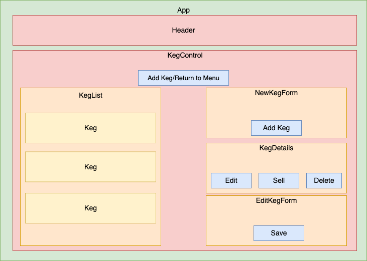

# 
 **Tap 🕔 Time**

#### _React website for a tap room to track their kegs._

#### By _**Chris Depastenen**_

## Table of Contents

1. [Description](#description)
2. [Technologies Used](#technologies)
3. [Setup/Installation Requirements](#setup)
4. [Known Bugs](#bugs)
5. [Contact Information](#contact)
6. [License](#license)

## Description 

Application allows users to view kegs on tap, type of beer, brewer, alcohol content, and price. The application also disaplys the keg fill status, which updates as the keg empties. Users can create, edit, and delete kegs, as well as sell pints, decrementing available pints and affecting the keg fill status.

## Component Diagram

## Technologies Used 

* HTML
* CSS
* JavaScript/JSX
* NPM
* Webpack

## Project Setup/Installation Instructions 

* Clone down repository to your desktop or preferred location.
* Using your terminal, navigate to root folder of the project directory.
* Run `npm install` to install necessary dependencies.
* Run `npm run start` to start a live server and view projec in the browser.

## Known Bugs 

- _None._

## Contact 

Chris Depastene - [Email](mailto:cdepastene@gmail.com) • [LinkedIn](https://www.linkedin.com/in/christopherdepastene/) • [GitHub](https://github.com/chrisdfghjkl)

## License 

Copyright (c) 2022 **_Chris Depastene_**

Permission is hereby granted, free of charge, to any person obtaining a copy of this software and associated documentation files (the "Software"), to deal in the Software without restriction, including without limitation the rights to use, copy, modify, merge, publish, distribute, sublicense, and/or sell copies of the Software, and to permit persons to whom the Software is furnished to do so, subject to the following conditions:

The above copyright notice and this permission notice shall be included in all copies or substantial portions of the Software.

THE SOFTWARE IS PROVIDED "AS IS", WITHOUT WARRANTY OF ANY KIND, EXPRESS OR IMPLIED, INCLUDING BUT NOT LIMITED TO THE WARRANTIES OF MERCHANTABILITY, FITNESS FOR A PARTICULAR PURPOSE AND NONINFRINGEMENT. IN NO EVENT SHALL THE AUTHORS OR COPYRIGHT HOLDERS BE LIABLE FOR ANY CLAIM, DAMAGES OR OTHER LIABILITY, WHETHER IN AN ACTION OF CONTRACT, TORT OR OTHERWISE, ARISING FROM, OUT OF OR IN CONNECTION WITH THE SOFTWARE OR THE USE OR OTHER DEALINGS IN THE SOFTWARE.